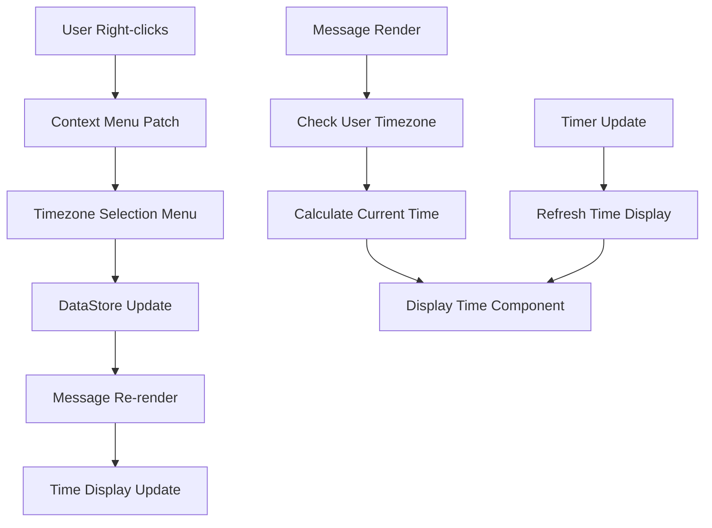

# Design Document

## Overview

The userMessagesTimezones plugin extends Discord's user interface to provide timezone awareness for better cross-timezone communication. The plugin consists of three main components: a context menu integration for setting timezones, a local data storage system for persisting timezone associations, and a message decoration system for displaying current local times.

The plugin follows Vencord's established patterns for context menu patches, data storage, and message decorations, ensuring seamless integration with the existing Discord interface and other Vencord plugins.

## Architecture

### Core Components

1. **Context Menu Integration**

    - Patches the `user-context` menu to add timezone management options
    - Provides hierarchical menu structure for timezone selection
    - Handles timezone setting and removal operations

2. **Data Storage Layer**

    - Uses Vencord's DataStore API for persistent local storage
    - Stores user ID to timezone mappings
    - Handles data migration and cleanup operations

3. **Message Decoration System**

    - Patches Discord's message rendering to inject timezone information
    - Displays current local time next to usernames
    - Updates time display in real-time

4. **Timezone Management**
    - Utilizes browser's native Intl.DateTimeFormat API
    - Supports all IANA timezone identifiers
    - Handles timezone calculations and formatting

### Data Flow



## Components and Interfaces

### Context Menu Component

```typescript
interface TimezoneContextMenuProps {
    user: User;
    onClose: () => void;
}

interface TimezoneSubmenuProps {
    user: User;
    currentTimezone?: string;
    onTimezoneSelect: (timezone: string) => void;
    onTimezoneRemove: () => void;
}
```

The context menu component integrates with Discord's existing user context menu system using Vencord's ContextMenu API. It provides:

-   "Set Timezone" option with submenu containing IANA timezone options
-   "Remove Timezone" option when timezone is already set
-   Grouped timezone options by region (America/, Europe/, Asia/, etc.)

### Data Storage Interface

```typescript
interface TimezoneStorage {
    [userId: string]: string; // IANA timezone identifier
}

interface TimezoneDataManager {
    setUserTimezone(userId: string, timezone: string): Promise<void>;
    getUserTimezone(userId: string): Promise<string | undefined>;
    removeUserTimezone(userId: string): Promise<void>;
    getAllUserTimezones(): Promise<TimezoneStorage>;
}
```

Data is stored using Vencord's DataStore API with the key `userMessagesTimezones_data`. The storage format is a simple object mapping user IDs to IANA timezone identifiers.

### Message Decoration Component

```typescript
interface TimezoneDisplayProps {
    message: Message;
    userId: string;
    timezone: string;
}

interface TimeDisplayState {
    currentTime: string;
    isValid: boolean;
}
```

The message decoration component follows the same pattern as userMessagesPronouns, injecting timezone information next to usernames in both normal and compact message display modes.

### Timezone Utilities

```typescript
interface TimezoneUtils {
    formatTime(timezone: string): string;
    isValidTimezone(timezone: string): boolean;
    getTimezoneGroups(): Record<string, string[]>;
    getCurrentTimeInTimezone(timezone: string): Date;
}
```

## Data Models

### Timezone Data Structure

```typescript
type TimezoneData = {
    [userId: string]: string; // IANA timezone ID
};
```

### IANA Timezone Groups

Timezones are organized into logical groups for the context menu:

```typescript
const TIMEZONE_GROUPS = {
    "America": ["America/New_York", "America/Chicago", "America/Denver", "America/Los_Angeles", ...],
    "Europe": ["Europe/London", "Europe/Berlin", "Europe/Paris", "Europe/Rome", ...],
    "Asia": ["Asia/Tokyo", "Asia/Shanghai", "Asia/Kolkata", "Asia/Dubai", ...],
    "Australia": ["Australia/Sydney", "Australia/Melbourne", "Australia/Perth", ...],
    "Africa": ["Africa/Cairo", "Africa/Lagos", "Africa/Johannesburg", ...],
    "Pacific": ["Pacific/Honolulu", "Pacific/Auckland", "Pacific/Fiji", ...]
};
```

### Message Patch Integration

The plugin patches Discord's message rendering at two points:

1. Normal message display - next to timestamp
2. Compact message display - next to username

## Error Handling

### Storage Errors

-   Graceful degradation when DataStore operations fail
-   Fallback to in-memory storage for current session
-   User notification for persistent storage failures

### Timezone Calculation Errors

-   Validation of IANA timezone identifiers
-   Fallback to UTC for invalid timezones
-   Error boundaries around time calculation components

### Context Menu Errors

-   Error boundaries around context menu patches
-   Graceful handling of missing user data
-   Fallback behavior when menu patching fails

### Time Display Errors

-   Validation of timezone data before display
-   Graceful handling of invalid timezone calculations
-   Automatic cleanup of invalid timezone associations

## Testing Strategy

### Unit Tests

-   Timezone calculation utilities
-   Data storage operations
-   IANA timezone validation
-   Time formatting functions

### Integration Tests

-   Context menu patch functionality
-   Message decoration rendering
-   DataStore integration
-   Real-time time updates

### User Interface Tests

-   Context menu appearance and behavior
-   Time display formatting and positioning
-   Timezone selection and removal workflows
-   Compatibility with other message decoration plugins

### Performance Tests

-   Time calculation performance with multiple users
-   Memory usage with large timezone datasets
-   Context menu rendering performance
-   Message rendering impact assessment

## Implementation Considerations

### Performance Optimization

-   Lazy loading of timezone data
-   Efficient time calculation caching
-   Minimal DOM updates for time display
-   Debounced time updates to reduce CPU usage

### Browser Compatibility

-   Use of native Intl.DateTimeFormat API
-   Fallback for unsupported timezone identifiers
-   Cross-platform time calculation consistency

### Plugin Compatibility

-   Non-conflicting message decoration positioning
-   Shared context menu space management
-   Compatible styling with Discord themes
-   Coordination with other username decoration plugins

### User Experience

-   Intuitive timezone selection interface
-   Clear visual indication of timezone status
-   Consistent time format across all displays
-   Responsive time updates without performance impact

### Security Considerations

-   Input validation for timezone identifiers
-   Safe storage of user associations
-   No exposure of sensitive user data
-   Protection against timezone injection attacks
